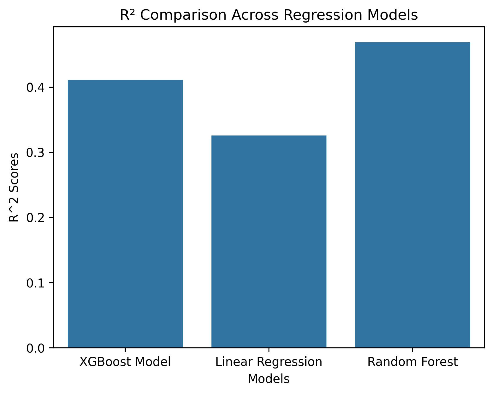
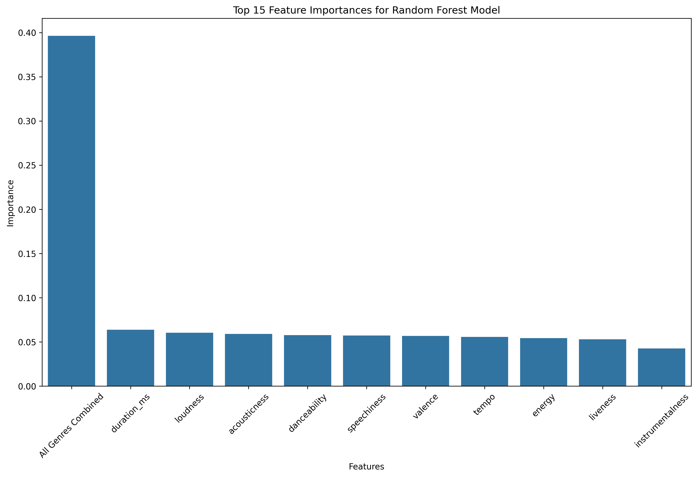
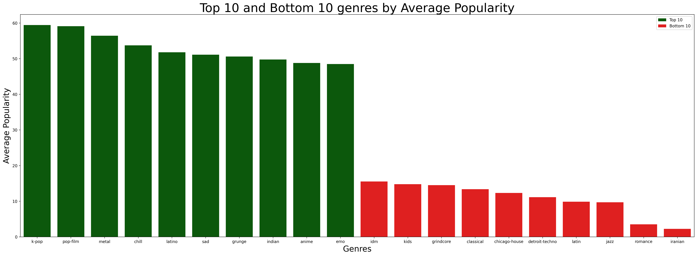

# Spotify Popularity Predictor

## Question

Songs are made up of many measurable components such as tempo, energy, danceability, speechiness, and more. The purpose of my project was to determine whether those objective audio characteristics can predict a song's popularity, both as an exact score (0-100) and as a binary outcome (popular vs. not, using a threshold). Is there a meaningful relationship between how a song sounds and how popular it becomes, or is popularity driven by factors that these features alone can't capture?

## Approach

The dataset that I used was a Spotify Tracks dataset on Kaggle that contained 114,000 songs, each having measurable feature data. The first thing that I tackled was cleaning up this dataset. I wanted to make sure to look for duplicates, unusual values, or aspects that could create inaccuracies in the models I use later on. Some things that I checked was whether or not there were duplicate song id's and if there were any songs with a tempo or duration value of 0. I found songs meeting both conditions and removed them, leaving 89,583 unique, cleaned songs. I also one-hot encoded the track_genre column so each genre could be used as a numeric feature, which expanded the dataset to over 130 columns. For splitting my data, I used an 80/20 train-test split with a fixed random state so my results would be reproducible, and for the classification split specifically I used stratified sampling to keep the same class balance in both sets. Once I cleaned the data, I analyzed two different angles of these songs: Regression and Classification. With Regression, I wanted to see if I was able to build a model that could pretty accurately predict a popularity score equivalent to a song's actual popularity value. And for classification, I wanted to truly see if these variables can be used in a model to classify if a song is popular or not in a binary fashion. For Regression, I used a linear regression model, a random forest regressor model, and an XGBoost model. And for Classification, I used a logistic regression model as well as a random forest classification model.

## Regression Findings

For the first model I worked with (Linear Regression), I was able to get a mean absolute error of 12.07 in popularity score, a root mean squared error value of 16.91 and a coefficient of determination of .325. The next model I constructed was the Random Forest Regressor which gave me statistical values of MAE: 10.12, RMSE: 15, and R^2: .469. The third model I worked with was an XGBoost model to see if I could get even more accuracy in predicting popularity score among songs. The model had a MAE of 11.07, an RMSE of 15.68, and an r^2 of .411. Surprisingly, the XGBoost model actually underperformed despite being the "fancier" model, and the audio features individually had pretty similar values of importance, clustered roughly between 0.043 and 0.064 each. However, genre's one-hot columns summed together had the highest importance value of .396 which outweighed any single audio feature by 6 times.

## Classification Findings

To begin with classification analysis, I first created a threshold for what score is considered "popular" for songs, which I ended up landing on the value 70. After filtering my dataset to see the ratio of popular to non-popular songs, I discovered that there were 86,459 songs in my dataset that were defined as "non-popular" and only 3,124 songs that were considered "popular." The problem with this was that a model could predict "not popular" for every single song and still be right 96.5% of the time. That's why accuracy wasn't a useful metric here, and why I relied on precision, recall and F1 values instead. These actually measure whether the model is finding real patterns in popularity prediction. I used stratify = y_class in my train/test split so both sets kept the same 96.5/3.5 ratio, rather than risking an even more skewed split by chance. I used a balanced class weight so the models were penalized far more heavily for missing an actual popular song than a false alarm. This setting had a dramatic effect on Logistic Regression specifically, pushing recall from 0.0016 unweighted to 0.87 balanced, while Random Forest barely benefited from the same setting. Overall, my Logistic Regression model outperformed the Random Forest Classifier with an F1 value of .2030 vs 0.091 at each model's best configuration.

Across all five models I tried (three regression approaches and two classification approaches) I came to find that none of them achieved strong predictive power, with R² topping out under 0.5 and F1 topping out around 0.2. That consistency across genuinely different types of models suggests that song popularity isn't strongly determined by these audio features alone, rather than pointing to a need for better-tuned models.

## Surprises

One main surprise that I came across this project was how XGBoost underperformed Random Forest despite being the more sophisticated model. Going in, I expected XGBoost's sequential, error-correcting approach to outperform a simpler bagging method like Random Forest, but the results showed that a more complex model doesn't automatically mean better performance, especially without hyperparameter tuning. This reinforced that model choice isn't just about picking the newest or most advanced-sounding option; it depends on how well that model fits the specific structure of the data.

Another surprise that caught my eye was how K-pop had the highest average genre popularity (59) while genres like hip-hop/rap, which are more globally listened to, didn't rank as high. This stood out because I expected raw popularity scores to track more closely with what's most widely consumed worldwide. It's a reminder that this dataset's "popularity" score reflects something more specific than overall global listenership; it's likely shaped by factors like the size and engagement of a fanbase on the platform, streaming and release patterns, or how Spotify's own popularity metric is calculated, rather than a fanbase's raw size. It made me realize that the audio features themselves are only one piece of a much larger picture that includes cultural and platform-specific dynamics.

## Limitations

Some limitations I wanted to cover was that XGBoost wasn't hyperparameter-tuned, which is a large factor in accuracy output, so the exact ranking could relatively change compared to Random Forest's accuracy statistics. Another limitation was that the popularity threshold I chose (70) was reasonable but a somewhat random choice rather than a tested and statistically effective threshold. The dataset is also a few years old so it may not reflect current listening trends or newer artists. There are a lot of variables that constantly change how people view music and what people enjoy. Also, one-hot encoding genre means individual genre columns get diluted importance scores even though genre matters a lot in aggregate. It can make feature importance rankings somewhat easier to misread if only viewing the individual list.

Some things I would want to explore further are fine-tuning the XGBoost model to see if I can get better accuracy, and experimenting with derived features that I deliberately held off on while building my baseline models — things like bucketing tempo into categories or combining loudness and energy into a single composite feature, to see if engineered features could capture patterns the raw audio features on their own couldn't. I'd also be curious to rerun this analysis on a more recent dataset if one becomes available, since Spotify has deprecated public access to its own audio features API for new developer apps, which limited my sourcing options for this project.

## Summary

Overall, this project did not find any clear patterns in the data that showed specific audio features had a strong correlation to a song's popularity. There are so many genres, types of music, styles, and ways of creating art that people interpret in different ways, and I believe this diversity in taste is part of why it can be hard to predict popularity through an algorithm based on audio features alone. That said, this isn't a proven conclusion — it's the pattern I observed across the models and features I tested here, and a different approach, more data, or additional context could still reveal relationships that weren't captured in this project.

## Dataset

[Spotify Tracks Dataset](https://www.kaggle.com/datasets/maharshipandya/-spotify-tracks-dataset) (Kaggle, by maharshipandya) — ~114,000 tracks with audio feature data, cleaned down to 89,583 unique tracks for this project.

## Notebooks

1. `01_data_cleaning.ipynb` — initial data loading and cleaning
2. `02_eda.ipynb` — exploratory data analysis and visualizations
3. `03_linear_regression.ipynb` — feature engineering + Linear Regression baseline
4. `04_random_forest.ipynb` — Random Forest Regressor
5. `05_xgboost.ipynb` — XGBoost Regressor
6. `06_classification.ipynb` — Logistic Regression + Random Forest Classifier

## Setup

1. Clone this repo
2. Install dependencies: `pip3 install pandas numpy matplotlib seaborn scikit-learn xgboost jupyter`
3. Download the dataset from the Kaggle link above and place it in the project folder
4. Open notebooks in order with Jupyter or VS Code
